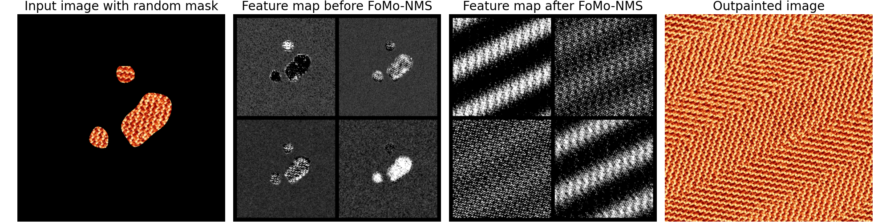

# FoMo-NMS: Fourier Modulus Non-Maximm Suppression for large texture outpainting — official PyTorch code.
## [Pierrick Chatillon](https://scholar.google.com/citations?user=8MgK55oAAAAJ&hl=en) | [Julien Rabin](https://sites.google.com/site/rabinjulien/) | [David Tschumperlé](https://tschumperle.users.greyc.fr/)

# [Arxiv]() [HAL]() [Paper]()


*Outpainting example:*


## Contents
- `images/data/` : resized and croped images from the [NUUR-Texture500](https://zenodo.org/records/7127079) dataset
- `images/figures/` : Inference results, reproducible in ./reproducible_figures.ipynb. Illustrations in the paper come from this folder.
- `runs/` : Models setups and weights
- Notebooks: `Experiments.ipynb`, `reproductible_inference.ipynb`

## Installation

Recommended: create a conda environment and install dependencies:

```bash
conda env create -f requirements.yml
conda activate fomonms
```

## Training

Run training (short):

```bash
python train.py --name $1 --dataset_path $2 --fourier_mode $3 
```

## Inference

Inference scripts are in `reproductible_figures.ipynb`. Changing the seed allows for more results.

## Reproducibility

- All of the weights of the netrworks are provided. Training runs were seeded and can be reproduced thanks to the config.
- Use `reproductible_figures.ipynb` to reproduce the figures in the paper.
- Run `metrics.ipynb` to reproduce the values of the tables of the paper.

## Citation
If you use this code in a publication, please cite the associated paper.

## License
MIT

## Acknowledgments
This  work  was  partly  funded  by  the  Normandy  Region  through  theIArtist excellence label project.
The architecture of the network is heavily inspired by the [FastGAN repo](https://github.com/bingchenlll/FastGAN-pytorch)

## Citation
If you use this code for your research, please cite our paper:

```

```

## License
This work is under the MIT license.

## Disclaimer
The code is provided "as is" with ABSOLUTELY NO WARRANTY expressed or implied.